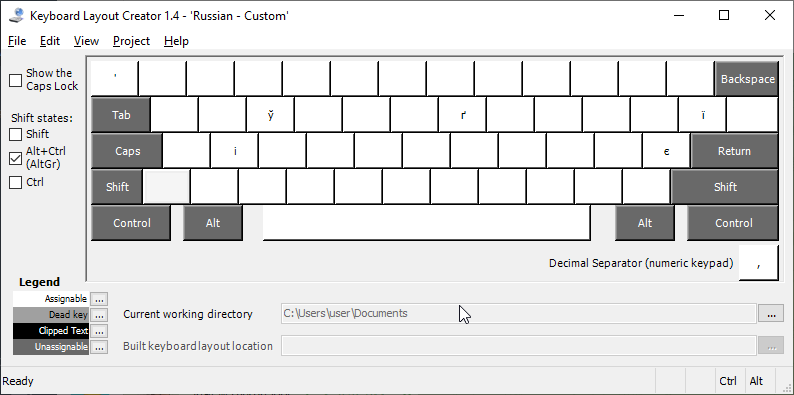

# Russian keyboard layout with ukranian characters 

This layout is created from standard Windows Ukrainian (Enhanced) layout
using [Microsoft Keyboard Layout Creator (MSKLC) Version 1.4](https://www.microsoft.com/en-us/download/details.aspx?id=102134)

 ## Installation
 
 1. Download zip file from releases
 2. Run setup.exe from zip
 3. Restart your PC

## Demo of added characters
 
 
 
